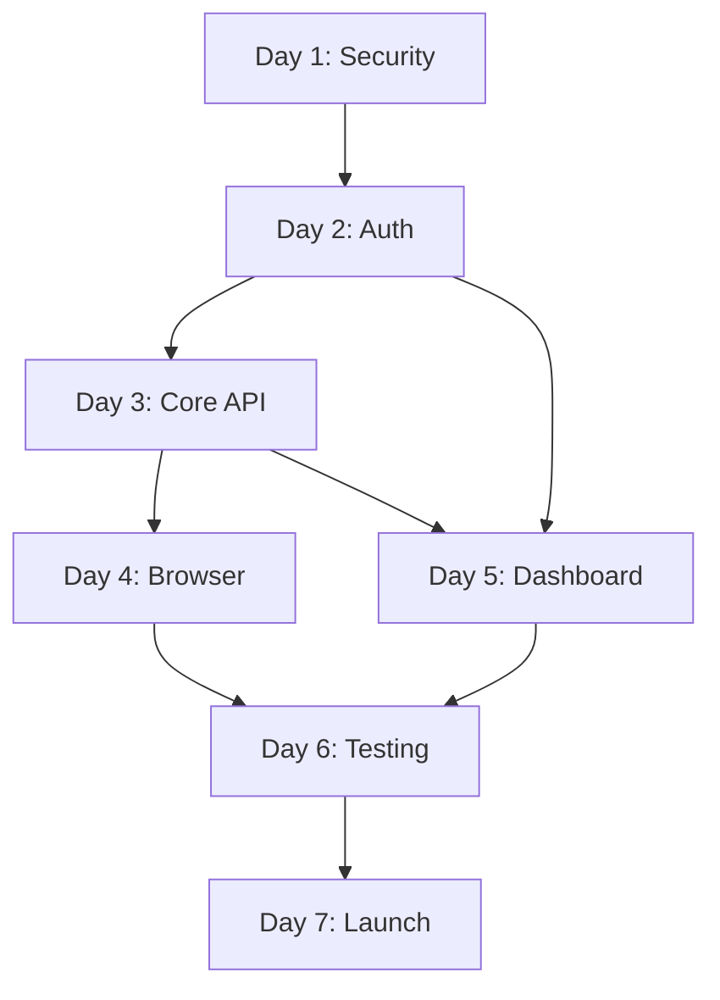

# ROADMAP.md - Development Roadmap

**Project**: Scraper API MVP
**Version**: 1.0.0
**Last Updated**: 2025-12-25

---

## 1. Day-by-Day Implementation Guide

### Day 1: Security Foundation (8 hours)

| Time      | Task                      | Files to Create                                     | Deliverable              |
| --------- | ------------------------- | --------------------------------------------------- | ------------------------ |
| 0:00-0:30 | Project setup             | `package.json`, `turbo.json`, `pnpm-workspace.yaml` | Monorepo initialized     |
| 0:30-1:30 | Cloudflare account setup  | -                                                   | Workers Paid plan active |
| 1:30-2:30 | Create D1 database        | `packages/db/schema.sql`                            | Database created         |
| 2:30-3:30 | Deploy database schema    | `packages/db/migrations/001_initial.sql`            | Tables created           |
| 3:30-5:30 | Implement SSRF protection | `apps/api/src/utils/ssrf.ts`                        | URL validation working   |
| 5:30-6:30 | Write SSRF tests          | `apps/api/tests/unit/ssrf.test.ts`                  | 100% coverage            |
| 6:30-8:00 | API key hashing utilities | `apps/api/src/utils/hash.ts`                        | SHA-256 hashing working  |

**Day 1 Checklist:**

- [ ] Cloudflare Workers Paid activated ($5)
- [ ] D1 database `scraper-api-db` created
- [ ] Schema deployed (users, api_keys, auth_logs, request_logs, sessions)
- [ ] SSRF protection blocks localhost, private IPs, metadata endpoints
- [ ] API key generation returns `sk_` + 64 hex chars
- [ ] API key hashing uses SHA-256

### Day 2: Authentication (8 hours)

| Time      | Task                   | Files to Create                                                        | Deliverable                |
| --------- | ---------------------- | ---------------------------------------------------------------------- | -------------------------- |
| 0:00-1:00 | GitHub OAuth app setup | -                                                                      | OAuth credentials obtained |
| 1:00-3:00 | Auth.js integration    | `apps/web/lib/auth.ts`, `apps/web/app/api/auth/[...nextauth]/route.ts` | OAuth flow working         |
| 3:00-4:00 | Auth middleware        | `apps/api/src/middleware/auth.ts`                                      | API key validation         |
| 4:00-5:30 | Atomic quota SQL       | `apps/api/src/services/quota.ts`                                       | Race-condition-free        |
| 5:30-6:30 | Request ID middleware  | `apps/api/src/middleware/request-id.ts`                                | Traceable requests         |
| 6:30-7:30 | Structured logging     | `apps/api/src/utils/logger.ts`                                         | JSON logs                  |
| 7:30-8:00 | Health endpoint        | `apps/api/src/handlers/health.ts`                                      | `/health` returns 200      |

**Day 2 Checklist:**

- [ ] GitHub OAuth app created with correct callback URLs
- [ ] `AUTH_SECRET`, `GITHUB_CLIENT_ID`, `GITHUB_CLIENT_SECRET` set
- [ ] Login flow redirects to GitHub and back
- [ ] User created in D1 on first login
- [ ] API key lookup by hash working
- [ ] Quota UPDATE uses RETURNING clause
- [ ] Request IDs in format `req_<timestamp>_<random>`
- [ ] `/health` endpoint accessible without auth

### Day 3: Core API (8 hours)

| Time      | Task                  | Files to Create                                                              | Deliverable              |
| --------- | --------------------- | ---------------------------------------------------------------------------- | ------------------------ |
| 0:00-1:00 | Worker entry point    | `apps/api/src/index.ts`                                                      | Hono app configured      |
| 1:00-2:00 | Router setup          | `apps/api/src/router.ts`                                                     | Routes organized         |
| 2:00-4:00 | Light scraping        | `apps/api/src/services/scraper-light.ts`                                     | Cheerio extraction       |
| 4:00-5:30 | Scrape handler        | `apps/api/src/handlers/scrape.ts`                                            | `/api/v1/scrape` working |
| 5:30-6:30 | Rate limit middleware | `apps/api/src/middleware/rate-limit.ts`                                      | Quota enforcement        |
| 6:30-8:00 | Error handling        | `apps/api/src/utils/response.ts`, `apps/api/src/middleware/error-handler.ts` | Consistent errors        |

**Day 3 Checklist:**

- [ ] Worker deploys successfully
- [ ] CORS configured for dashboard origin
- [ ] Light scraping returns HTML content
- [ ] CSS selector extraction working
- [ ] Rate limit headers included (X-RateLimit-\*)
- [ ] Error responses include request_id
- [ ] All errors are JSON with code/message

### Day 4: Browser Rendering (8 hours)

| Time      | Task                  | Files to Create                          | Deliverable                |
| --------- | --------------------- | ---------------------------------------- | -------------------------- |
| 0:00-4:00 | Puppeteer integration | `apps/api/src/services/scraper-heavy.ts` | Browser rendering          |
| 4:00-6:00 | Screenshot handler    | `apps/api/src/handlers/screenshot.ts`    | `/api/v1/screenshot`       |
| 6:00-7:00 | Timeout handling      | -                                        | 30s max, graceful failures |
| 7:00-8:00 | Wait for selector     | -                                        | `wait_for` parameter       |

**Day 4 Checklist:**

- [ ] Puppeteer launches on Cloudflare
- [ ] JavaScript-rendered content extracted
- [ ] Screenshots returned as binary
- [ ] Format options: PNG, JPEG, WebP
- [ ] Full-page screenshots working
- [ ] Timeout errors return 504
- [ ] `wait_for` waits for selector before extraction

### Day 5: Dashboard (8 hours)

| Time      | Task               | Files to Create                                           | Deliverable         |
| --------- | ------------------ | --------------------------------------------------------- | ------------------- |
| 0:00-1:00 | Next.js setup      | `apps/web/package.json`, `apps/web/next.config.mjs`       | Project configured  |
| 1:00-2:00 | Tailwind setup     | `apps/web/tailwind.config.ts`, `apps/web/app/globals.css` | Styling ready       |
| 2:00-3:30 | Layout components  | `apps/web/components/dashboard/*`                         | Header, nav, layout |
| 3:30-5:00 | Dashboard page     | `apps/web/app/(dashboard)/dashboard/page.tsx`             | Usage stats visible |
| 5:00-6:30 | API key management | `apps/web/app/(dashboard)/api-keys/page.tsx`              | Create/revoke keys  |
| 6:30-8:00 | Playground         | `apps/web/app/(dashboard)/playground/page.tsx`            | Test API in browser |

**Day 5 Checklist:**

- [ ] Next.js app builds successfully
- [ ] Auth.js protects dashboard routes
- [ ] User avatar and name displayed
- [ ] Quota usage shown (used/limit)
- [ ] API key created and displayed (once)
- [ ] API key revoked successfully
- [ ] Playground sends real requests
- [ ] Response displayed with syntax highlighting

### Day 6: Integration & Testing (8 hours)

| Time      | Task               | Files to Create                             | Deliverable        |
| --------- | ------------------ | ------------------------------------------- | ------------------ |
| 0:00-2:00 | Landing page       | `apps/web/app/(marketing)/page.tsx`         | Marketing content  |
| 2:00-3:00 | Pricing page       | `apps/web/app/(marketing)/pricing/page.tsx` | Tier comparison    |
| 3:00-4:00 | Documentation page | `apps/web/app/(marketing)/docs/page.tsx`    | API reference      |
| 4:00-5:30 | E2E testing        | -                                           | All flows verified |
| 5:30-7:00 | CI/CD setup        | `.github/workflows/*`                       | Automated deploy   |
| 7:00-8:00 | Bug fixes          | -                                           | Blockers resolved  |

**Day 6 Checklist:**

- [ ] Landing page has hero, features, code example
- [ ] Pricing shows Free tier details
- [ ] Documentation has quick start
- [ ] Manual test: signup -> create key -> scrape -> view usage
- [ ] GitHub Actions deploys on push to main
- [ ] Deployment succeeds without errors
- [ ] Health check passes after deploy

### Day 7: Launch (8 hours)

| Time      | Task                 | Deliverable             |
| --------- | -------------------- | ----------------------- |
| 0:00-1:00 | Final deployment     | Production live         |
| 1:00-2:00 | Custom domain setup  | api.scraper.dev working |
| 2:00-3:00 | SSL verification     | HTTPS everywhere        |
| 3:00-4:00 | Smoke testing        | All endpoints verified  |
| 4:00-5:00 | Documentation review | No broken links         |
| 5:00-6:00 | Beta invitations     | 5-10 users invited      |
| 6:00-8:00 | Monitoring           | Watch first requests    |

**Day 7 Checklist:**

- [ ] Production deployment successful
- [ ] Custom domain resolves correctly
- [ ] SSL certificate active
- [ ] `/health` returns 200
- [ ] `/api/v1/scrape` works with real key
- [ ] `/api/v1/screenshot` returns image
- [ ] Dashboard loads at scraper.dev
- [ ] OAuth flow works in production
- [ ] First beta user successfully scrapes
- [ ] No errors in Cloudflare dashboard

---

## 2. Task Dependencies



### Critical Path

1. **D1 Database** must be ready before any user operations
2. **Auth.js** must work before dashboard development
3. **Light scraping** must work before heavy scraping
4. **CI/CD** must work before launch

### Parallel Work Opportunities

- Day 5-6: Dashboard and landing page can be developed in parallel
- Day 6: E2E testing can start while finishing landing page
- Day 7: Beta invitations can go out while monitoring

---

## 3. Milestone Definitions

### Milestone 1: Foundation Complete (End of Day 2)

**Criteria:**

- Database schema deployed
- User can log in with GitHub
- API key generated on signup
- Security utilities tested

**Demo:**

```bash
# User logs in, key is created
# Verify in D1
wrangler d1 execute scraper-api-db --command="SELECT * FROM users" --remote
```

### Milestone 2: API Functional (End of Day 4)

**Criteria:**

- Light scraping works
- Heavy scraping works
- Screenshots work
- Rate limiting enforced

**Demo:**

```bash
curl -X POST https://api.scraper.dev/v1/scrape \
  -H "X-API-Key: sk_test_..." \
  -d '{"url": "https://example.com", "render": true}'
```

### Milestone 3: Dashboard Ready (End of Day 5)

**Criteria:**

- User can view usage
- User can manage API keys
- User can test in playground

**Demo:**

- Navigate to dashboard
- Show usage stats
- Create new API key
- Test in playground

### Milestone 4: Launch Ready (End of Day 7)

**Criteria:**

- All endpoints working
- Custom domain configured
- Documentation complete
- First users invited

**Demo:**

- Full user journey
- Real data extraction
- Usage tracking

---

## 4. Testing Checkpoints

### Day 2 Testing

```bash
# Test auth flow
1. Visit /login
2. Click "Continue with GitHub"
3. Authorize app
4. Verify redirect to /dashboard
5. Verify user in database
```

### Day 3 Testing

```bash
# Test light scraping
curl -X POST http://localhost:8787/api/v1/scrape \
  -H "X-API-Key: sk_test_..." \
  -H "Content-Type: application/json" \
  -d '{"url": "https://example.com"}'

# Expected: HTML content, 200 status

# Test invalid URL
curl -X POST http://localhost:8787/api/v1/scrape \
  -H "X-API-Key: sk_test_..." \
  -d '{"url": "http://localhost:3000"}'

# Expected: SSRF_BLOCKED, 400 status
```

### Day 4 Testing

```bash
# Test heavy scraping
curl -X POST http://localhost:8787/api/v1/scrape \
  -H "X-API-Key: sk_test_..." \
  -d '{"url": "https://spa-example.com", "render": true}'

# Test screenshot
curl -X POST http://localhost:8787/api/v1/screenshot \
  -H "X-API-Key: sk_test_..." \
  -d '{"url": "https://example.com"}' \
  --output screenshot.png
```

### Day 6 Testing

**Manual E2E Test Script:**

1. Open incognito browser
2. Navigate to https://scraper.dev
3. Click "Start Free"
4. Complete GitHub OAuth
5. Verify redirect to dashboard
6. Note displayed usage (should be 0/100)
7. Navigate to API Keys
8. Create new key named "Test"
9. Copy the displayed key
10. Navigate to Playground
11. Enter URL: https://example.com
12. Click "Send Request"
13. Verify response shows content
14. Navigate back to Dashboard
15. Verify usage is now 1/100
16. Revoke the test key
17. Try playground again (should fail)
18. Log out
19. Verify redirect to home

---

## 5. Launch Checklist

### Pre-Launch (Day 6)

- [ ] All tests passing
- [ ] No TypeScript errors
- [ ] No ESLint warnings
- [ ] Environment variables documented
- [ ] Secrets rotated from development
- [ ] Database backed up

### Launch Day

- [ ] Deploy API Worker to production
- [ ] Deploy web to Cloudflare Pages
- [ ] Configure custom domain
- [ ] Verify SSL certificate
- [ ] Run smoke tests
- [ ] Send beta invitations
- [ ] Monitor error rates
- [ ] Check Cloudflare analytics

### Post-Launch (Immediate)

- [ ] Respond to first user issues
- [ ] Monitor quota usage
- [ ] Check for unusual patterns
- [ ] Verify logging working
- [ ] Collect initial feedback

---

## 6. Post-Launch Priorities (Week 2+)

### Days 8-10: Stabilization

| Priority | Task                   | Effort    |
| -------- | ---------------------- | --------- |
| P0       | Fix user-reported bugs | As needed |
| P0       | Improve error messages | 2 hours   |
| P1       | Add missing edge cases | 4 hours   |
| P1       | Optimize slow queries  | 2 hours   |
| P2       | Add request logging UI | 4 hours   |

### Week 2: Enhancements

| Priority | Task                   | Effort  |
| -------- | ---------------------- | ------- |
| P1       | JSON extraction mode   | 4 hours |
| P1       | Custom headers support | 2 hours |
| P2       | PDF export             | 4 hours |
| P2       | Webhook callbacks      | 6 hours |

### Week 3-4: Growth Features

| Priority | Task                      | Effort  |
| -------- | ------------------------- | ------- |
| P1       | Pro tier implementation   | 8 hours |
| P1       | Stripe integration        | 6 hours |
| P2       | Team accounts             | 8 hours |
| P2       | Usage analytics dashboard | 6 hours |

### Month 2: Scale

| Priority | Task                      | Effort  |
| -------- | ------------------------- | ------- |
| P1       | Additional auth providers | 4 hours |
| P1       | Rate limit by plan        | 4 hours |
| P2       | API versioning strategy   | 4 hours |
| P2       | SDKs (Python, Node)       | 8 hours |

---

## 7. Risk Mitigation Timeline

### High Risk Items (Address Days 1-2)

| Risk                    | Mitigation          | Owner    |
| ----------------------- | ------------------- | -------- |
| SSRF vulnerability      | Implement on Day 1  | Security |
| Race condition in quota | Atomic SQL on Day 2 | Backend  |
| Plain-text API keys     | Hash on creation    | Backend  |

### Medium Risk Items (Address Days 3-4)

| Risk                  | Mitigation                | Owner   |
| --------------------- | ------------------------- | ------- |
| Puppeteer cold starts | Document expected latency | Docs    |
| D1 beta changes       | Pin versions              | DevOps  |
| 2-session limit       | Implement queue (future)  | Backend |

### Low Risk Items (Address Week 2+)

| Risk               | Mitigation           | Owner   |
| ------------------ | -------------------- | ------- |
| No persistent logs | Add D1 logging       | Backend |
| No alerting        | Set up health checks | DevOps  |
| Documentation gaps | Community feedback   | Docs    |

---

## 8. Success Criteria Summary

### Day 7 (Launch)

| Metric              | Target          |
| ------------------- | --------------- |
| Uptime              | 99%             |
| API Latency (light) | < 500ms p95     |
| API Latency (heavy) | < 5s p95        |
| Error Rate          | < 1%            |
| Security Issues     | 0 CRITICAL/HIGH |

### Week 1

| Metric         | Target |
| -------------- | ------ |
| Beta Users     | 5-10   |
| API Requests   | 100+   |
| Critical Bugs  | < 5    |
| User Retention | 50%    |

### Month 1

| Metric               | Target |
| -------------------- | ------ |
| Registered Users     | 50-100 |
| Monthly Active Users | 20+    |
| Monthly Cost         | < $15  |
| NPS Score            | > 30   |

---

## Document Cross-References

- Master plan: [BLUEPRINT.md](./BLUEPRINT.md)
- Architecture: [ARCHITECTURE.md](./ARCHITECTURE.md)
- Backend: [BACKEND.md](./BACKEND.md)
- Frontend: [FRONTEND.md](./FRONTEND.md)
- Deployment: [DEPLOYMENT.md](./DEPLOYMENT.md)

---

_Roadmap Version 1.0.0 - Created 2025-12-25_
